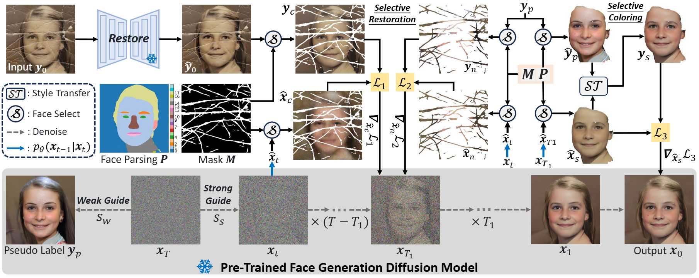

<div align="center">

<h1>Self-Supervised Selective-Guided Diffusion Model for Old-Photo Face Restoration</h1>

<div>
    <a href='https://24wenjie-li.github.io/' target='_blank'>Wenjie Li</a><sup>1</sup>&emsp;
    <a href='https://openreview.net/profile?id=~Xiangyi_Wang2' target='_blank'>Xiangyi Wang</a><sup>1</sup>&emsp;
    <a href='https://gh-home.github.io/' target='_blank'>Heng Guo</a><sup>1</sup>&emsp;
    <a href='https://guangweigao.github.io/' target='_blank'>Guangwei Gao</a><sup>2</sup>&emsp;
    <a href='https://zhanyuma.cn/index.html' target='_blank'>Zhanyu Ma</a><sup>1</sup>
</div>
<div>
    <sup>1</sup>Beijing University of Posts and Telecommunications&emsp; 
    <sup>2</sup>Nanjing University of Science and Technology&emsp; 
</div>

<div>
    :triangular_flag_on_post: <strong>Accepted to NeurIPS 2025</strong>
</div>

<div>
    <h4 align="center">
        • [<a href="https://24wenjie-li.github.io/projects/SSDiff/" target='_blank'>Project</a>]  &emsp; [<a href="https://arxiv.org/pdf/2510.12114" target='_blank'>arXiv</a>]  &emsp;  [<a href="" target='_blank'>Appendix</a>]•
    </h4>
</div>

<!--  -->

:star: If SSDiff is helpful to your images or projects, please help star this repo. Thanks! :hugs: 

---
</div>

### :postbox: Update
- 2025.10.11: This repo is created.

### :wrench: TODO
- [ ] Relase restoration results.
- [ ] Relase our constructed old-photo face dataset, VintageFace.
- [x] Relase checkpoint and script for old photo face restoration.
- [x] Relase codes and config files.
- [x] Release paper on arxiv.


### Dependencies and Installation

- Pytorch >= 1.7.1
- CUDA >= 10.1
- Other required packages in `requirements.txt`
```
# git clone this repository
git clone https://github.com/PRIS-CV/SSDiff
cd SSDiff

# create new anaconda env
conda create -n SSDiff python=3.8 -y
conda activate SSDiff

# install python dependencies
conda install mpi4py
pip3 install -r requirements.txt
pip install -e .
```
<!-- conda install -c conda-forge dlib -->


### Quick Inference

#### Download Pre-trained Models:
Download the pretrained face generation diffusion model `iddpm_ffhq512_ema500000.pth` from [[Google Drive]()] to `models` folder, the pretrained face parsing model `resnet34.pt` from [[Google Drive]()] to `models/face_parsing` folder, the pretrained style transfer model `photo_image.pt` from [[Google Drive]()] to `CAP_VSTNet/checkpoints` folder.

Download the facelib and dlib pretrained models from [[Releases](https://github.com/sczhou/CodeFormer/releases/tag/v0.1.0) | [OneDrive](https://entuedu-my.sharepoint.com/:f:/g/personal/s200094_e_ntu_edu_sg/EvDxR7FcAbZMp_MA9ouq7aQB8XTppMb3-T0uGZ_2anI2mg?e=DXsJFo)] to the `weights/facelib` folder and `weights` folder, separately. You can manually download the pretrained models OR download by running the following command:
```
python scripts/download_pretrained_models.py facelib
python scripts/download_pretrained_models.py dlib (only for dlib face detector)
```

Download the pretrained restore model `codeformer.pth` and pretrained VQGAN model `vqgan_code1024.pth` from [[Releases](https://github.com/sczhou/CodeFormer/releases/tag/v0.1.0) | [OneDrive](https://entuedu-my.sharepoint.com/:f:/g/personal/s200094_e_ntu_edu_sg/EoKFj4wo8cdIn2-TY2IV6CYBhZ0pIG4kUOeHdPR_A5nlbg?e=AO8UN9)] to the `models/restorer` folder and `models/vqgan` folder, separately. You can manually download the pretrained models OR download by running the following command:
```
python scripts/download_pretrained_models.py CodeFormer
```

#### Download VintageFace Test dataset:
Coming soon!

#### Prepare Testing Data:
You can put the testing images in the `inputs/TestWhole` folder. If you would like to test on cropped and aligned faces, you can put them in the `inputs/cropped_faces` folder. You can get the cropped and aligned faces by running the following command:
```
# you may need to install dlib via: conda install -c conda-forge dlib
python extract_faces.py -i [input folder] -o [output folder]
```

- If scratches exist, a folder for mask(s) `mask_dir` must be specified with the name of each mask image corresponding to that of each input image. Each input mask shoud be a binary map with white pixels representing masked regions. *To obtain a scratch map automatically, we recommend using the [scratch detection model](https://github.com/microsoft/Bringing-Old-Photos-Back-to-Life#2-scratch-detection). One may also further adjust the scratch map with an image editing app (e.g., Photoshop).*

#### Testing:
🧑🏻 Old-Photo Face Restoration (cropped and aligned face)
```
# For generating reference pseudo-labelled faces (512x512)
python inference_fake_label.py --task old_photo_restoration --in_dir [input_image_path]  --mask_dir [mask_path] --out_dir [output_image_path] --guidance_scale 0.001 --seed 4321
```

```
# For breakage, fading, and blur faces (512x512)
# --self_dir refers to the path of the pseudo-labelled faces generated in the previous stage.
python inference_final.py --task old_photo_restoration --in_dir [input_image_path]  --mask_dir [mask_path] --out_dir [output_image_path] --guidance_scale 0.0035 --seed 4321 --self_dir [pseudo_labelled_faces_path]
```

🧑🏻 Face Restoration (cropped and aligned face)
```
# For only blur faces (512x512), You may choose not to use pseudo-labelled faces.
python inference_final.py --task restoration --in_dir [input_image_path] --out_dir [output_image_path] --guidance_scale 0.05
```

### Citation
If our work is useful for your research, please consider citing:

    @inproceedings{li2025self,
        title={Self-Supervised Selective-Guided Diffusion Model for Old-Photo Face Restoration},
        author={Li, Wenjie and Wang, Xiangyi and Guo, Heng and Gao, Guangwei and Ma, Zhanyu},
        booktitle={NeurIPs},
        year={2025}
    }


### Contact
If you have any questions, please feel free to reach me out at `lewj2408@gmail.com`. 